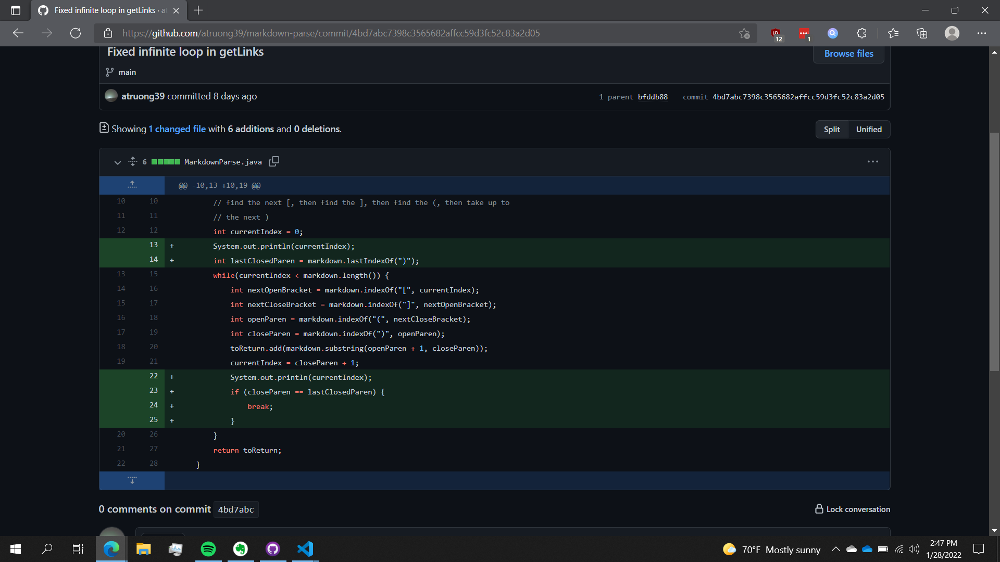
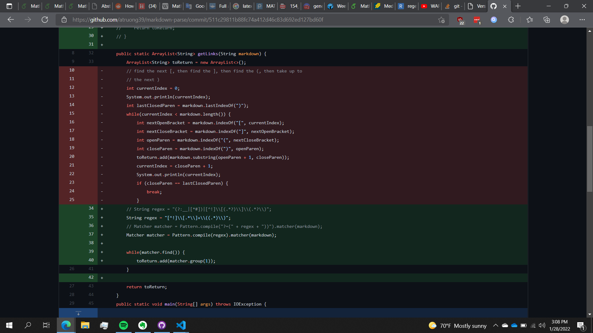
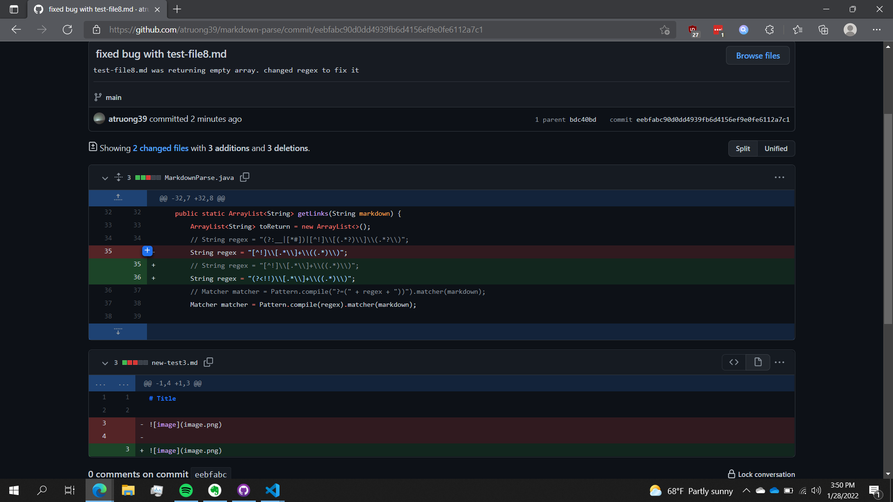

# CSE 15L: Lab Report 2, Week 4

## Bug 1:

Code difference: 



File which prompted change: [new-test.md](https://github.com/atruong39/markdown-parse/blob/main/new-test.md)

Output for the version where it was failing was an infinite loop. 

The issue with the failure-inducing input was that there was additional characters after the last markdown link. Our bug was at line 21, where it assumes that the last markdown link will be at the end of the markdown file. As a result, after the `while` loop goes through the last markdown link, we got the symptom of an infinite loop in which `currentIndex` is simply assigned to the value `closeParen + 1`.

## Bug 2:

Code difference: 



File which prompted change: [new-test3.md](https://github.com/atruong39/markdown-parse/blob/main/new-test3.md)

Output for the version where it was failing:

```
[image.png]
```

The symptom here is that `image.png` is not a URL link and should not be included as part of our output. The bug is that the solution for finding links was based on looking at occurences of square brackets and parantheses, with no consideration for how to omit image links. The problem with the failure-inducing input is because markdown files use very similar formatting for both image and URL links. 

## Bug 3: 

Code difference:



File which prompted change: [test-file8.md](https://github.com/atruong39/markdown-parse/blob/main/test-file8.md)

Output for the version where it was failing:

```
[]
```

The symptom was the program was outputting `[]` when it should have been `[a link on the first line]`. The bug was with the regular expression used:

```
"[^!]\\[.*\\]+\\((.*)\\)"
```
A regular expression that worked for `test-file.8.md` was: 
```
"(?<!!)\\[.*\\]+\\((.*)\\)"
```

The difference is how the regex chooses to omit the `!` used to denote image links. The problem with the failure inducing input is not clear to me as I am not very experienced with regular expressions. 