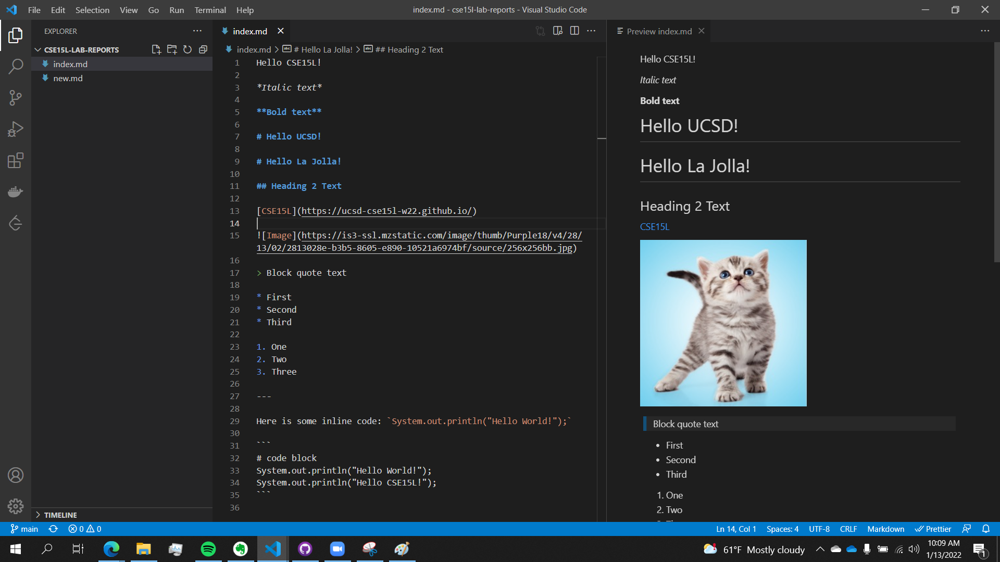

Hello CSE15L! 

*Italic text*

**Bold text**

# Hello UCSD!

# Hello La Jolla!

## Heading 2 Text

[CSE15L](https://ucsd-cse15l-w22.github.io/)




> Block quote text

* First 
* Second 
* Third 

1. One
2. Two
3. Three

---

Here is some inline code: `System.out.println("Hello World!");` 

```
# code block
System.out.println("Hello World!");
System.out.println("Hello CSE15L!");
```

Which of these links work?

[Lab Report 1](lab-report-1-week-2.html)

[Lab Report 1](https://atruong39.github.io/lab-report-1-week-2/lab-report-1-week-2.html)


[Lab Report 1](./lab-report-1-week-2.html)
