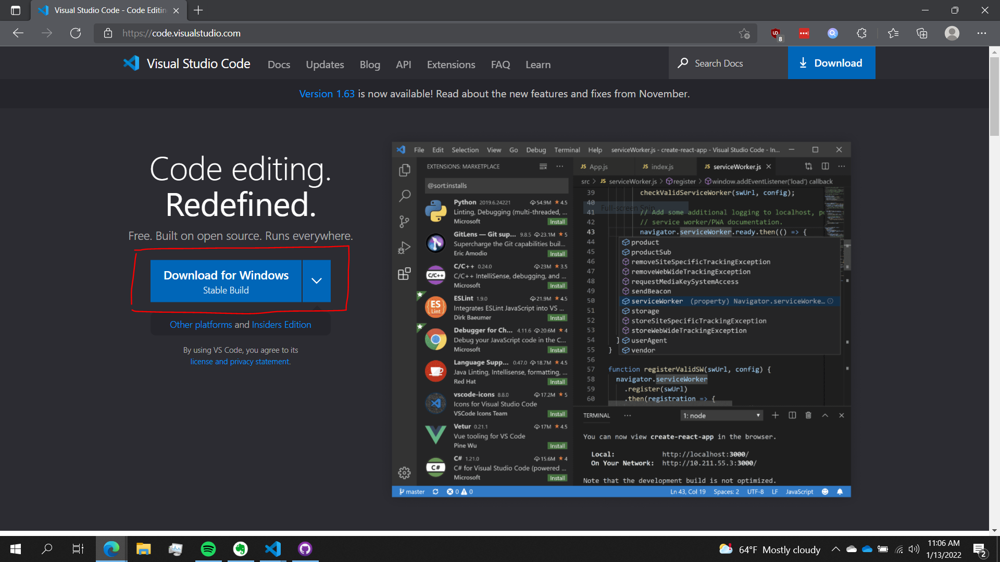
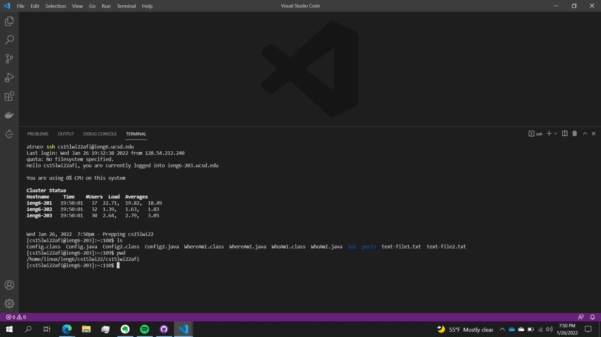
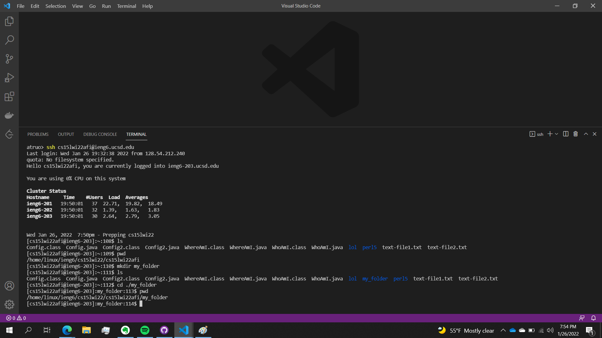
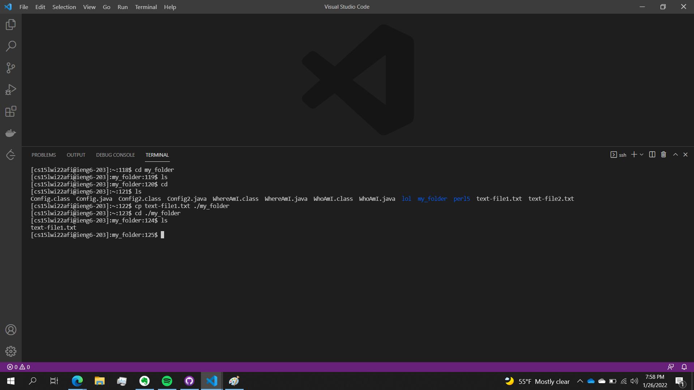

# CSE 15L: SSH Tutorial

Hello CSE 15L students! In this tutorial, we will go over how to log into your course-specific account on `ieng6` through `ssh`. If you are on Windows, then a preliminary step is to install OpenSSH. Follow this [link](https://docs.microsoft.com/en-us/windows-server/administration/openssh/openssh_install_firstuse) and follow the instructions. 

## Step 1: Install VS Code

Follow this [link](https://code.visualstudio.com/), download the VS Code installer for your platform, and run it:



## Step 2: Find Your Course-Specific Account

Follow this [link](https://sdacs.ucsd.edu/~icc/index.php) and enter your student information. On the next page, you will see a section called "Additional Accounts." Look for one in the the following format: 

```
cs15lwi22xxx
```

The `xxx` part of this string should be some other combination of letters or number unique to you. This string will be your username for `ieng6`. For this tutorial, we will using my username `cs15lwi22afi` as an example. 

## Step 3: Connect Remotely 

Open VS Code and open a terminal by either using Ctrl or Command + `, or by Terminal → New Terminal in the toolbar. 


Then enter the following command:

```
$ ssh cs15lwi22afi@ieng6.ucsd.edu
```

Since this is likely your first time connecting to this server, you will likely get a message like this: 


Type `yes` and press enter to continue. If you would like to learn more about the meaning of this message, follow this [link](https://superuser.com/questions/421074/ssh-the-authenticity-of-host-host-cant-be-established/421084#421084). 

Then type and enter your password. Be aware that when typing your password, no characters will appear on screen. Once logged in you will see something like this: 


Congratulations, you have just connected to a computer in the basement of the CSE building! Now you can run commands on this computer. 

## Step 4: Trying Out Commands

Some basic commands you should try out are `cd`, `ls`, `pwd`, `mkdir`, and `cp`. 

The `ls` command lists all files in the current working directory: 


The `pwd` command prints the current working directory. The result of entering the command: 



The `mkdir` command lets you create a new directory in the current working directory. To create a new folder named something like `my_folder`, you would enter this command: 

```
mkdir my_folder
```


You can see `my_folder` appear in the output of `ls`.

The `cd` command changes the working directory to the specified directory. So for example, to enter the `my_folder` command we just created, we would enter this command: 

```
cd ./my_folder
```

(The `.` indicates the working directory)



Notice how after using `pwd` after this command, it now outputs `my_folder`.

The `cp` command lets you copy files. The first argument is the source file and the second argument is the destination, including the name of the copy. So for example, in the following screenshot, look at how I return to the `cs15lwi22afi` directory to copy `text-file1.txt` into `my_folder`:



Notice how before running the `cp` command, using `ls` in `my_folder` returned nothing as the folder was empty. Now it returns the `text-file1.txt`, the that we copied from `cs15lwi22afi`.

There basic commands should be enough to get you started on some projects.

## Step 5: Moving Files with `scp`

Something important to working remotely is the ability to copy files between local and remote computers. `scp` is a handy command which allows you to copy files from your computer to a remote computer. 

First we will log off of `ieng6` by hitting Ctrl + D or by entering the command `exit`. Now create a file on your local computer called `WhoAmI.java` in your current working directory with the following contents:

```
class WhoAmI {
  public static void main(String[] args) {
    System.out.println(System.getProperty("user.name"));
  }
}
```

Compile and run the file using `javac` and `java`. You should see your usename on your computer: 


Now type the following command: 

```
$ scp WhoAmI.java cs15lwi22afi@ieng6.ucsd.edu:~/
```

Once you enter the password for your `ieng6` account. This will be the following output:


The file `WhoAmI.java` was copied over to `ieng6`! Now you can connect through `ssh` and look for the file with `ls`. Then compile and run the file, just like you did on your local machine. However, this time, the output will be your username on `ieng6`:


Next we will talk about how to expedite the process of working with remote computers. 

## Step 6: Setting an SSH Key

So far, we have had to use our password every time we wanted to connect to `ieng6` and after a certain point it can become tedious. A solution to this is using `ssh` keys which create a pair of files called a *private key* and a *public key*. You copy the *public key* onto a specific location on the server, and the *private key* in a specific location on the client. Then, `ssh` can use these files instead of your password. 

To start, enter the following command: 

```
$ ssh-keygen
```

Press enter when prompted for a file and passphrase. The output should be something like this:


If you are on Windows, then you will also need to the extra `ssh-add` steps at this [link](https://docs.microsoft.com/en-us/windows-server/administration/openssh/openssh_keymanagement#user-key-generation).

This created your public and private key files on your computer, stored in the `.ssh` directory. Now we need to copy the public key file to the `.ssh` directory of your account on `ieng6`:


If done correctly, you should now be able to log into `ieng6` without the need to enter your password:


Notice how after the `ssh cs15lwi22afi@ieng6.ucsd.edu` command, there is no prompt for a password! 

## Step 7: Optimizing Remote Running

There are few more tricks that can help speed up your remote workflow. 

* You can use quotation marks after `ssh` to just send a single command to a remote computer

    ```
    $ ssh cs15lwi22afi@ieng6.ucsd.edu "ls"
    ```

    This is the following output: 

    

    Neat! It listed the files in the home directory on the remote computer. This command is useful since sometimes, you do not need to login to a remote computer for anything more than a single command. 

* You can run multiple commands using semicolons:

    ```
    cp WhoAmI.java WhoAmICopy.java; javac WhoAmICopy.java; java WhoAmI
    ```

    This is an extremely versatile shortcut. For example, you could c

* You can use the arrow keys to cycle through previously entered commands. This is an extremely useful shortcut since very often, when programming, there are certain commands that you will need to repeat multiple times. For example, after making changes to a `.java` file, you will then need to run `javac` to compile the file and the `java` to run it. In addition, using this shortcut will help prevent typos.

All of these shortcuts combined, in addition to logging in with SSH keys, will help you program more smoothly and efficiently. For example, the following command, along with the arrow key shortcut, will allow us to upload `WhoAmI.java` to `ieng6` and compile and run it on `ieng6` in just two keystrokes:

```
scp WhoAmI.java cs15lwi22afi@ieng6.ucsd.edu:~/; ssh cs15lwi22afi@ieng6.ucsd.edu "javac WhoAmI.java; java WhoAmI"
```

Assuming that it was the last command in the terminal, the keystrokes are "up arrow" and then "enter." 

## Step 8: Conclusion

That concludes the tutorial. I hope you found it helpful! 
