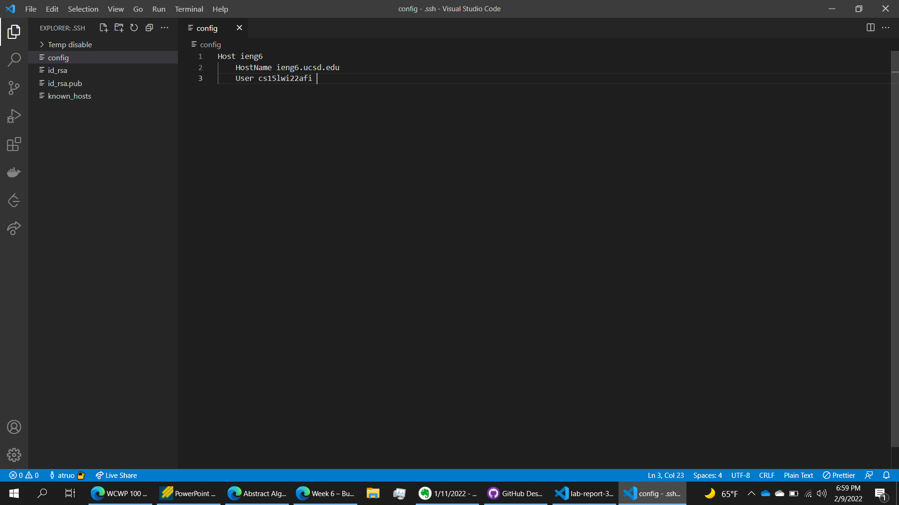
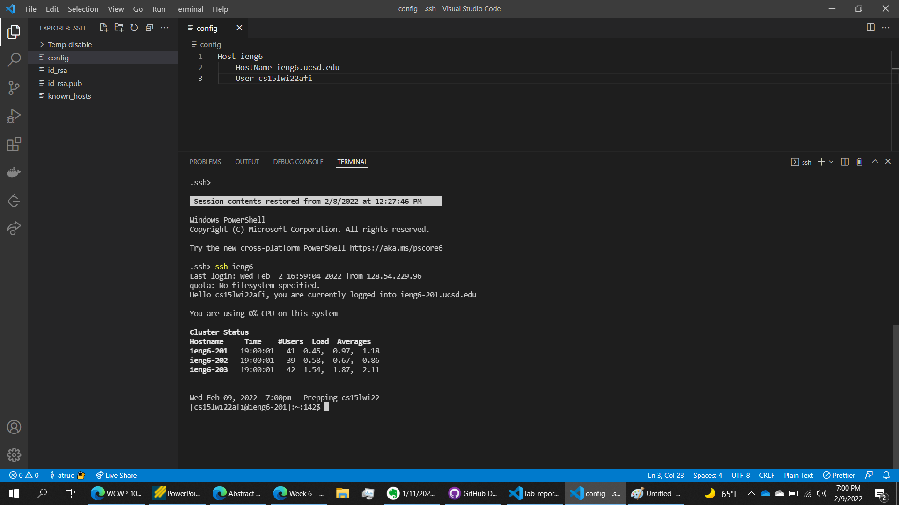
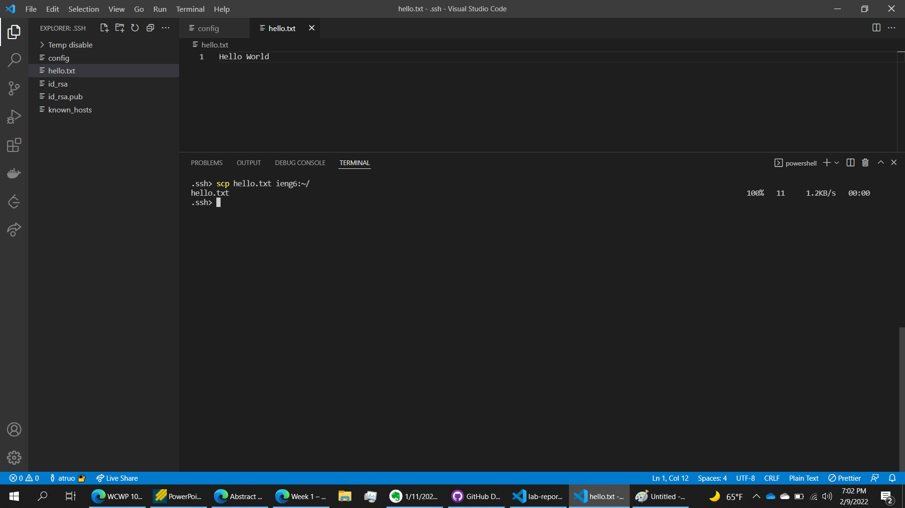

# CSE 15L: Lab Report 3, Week 6

I chose to streamline my `ssh` configuration. 

I created my `config` file in the `.ssh` directory using VS Code. 

Here I use the `ssh` command with the alias `ieng6` in order to login to my account. 

Here I use the `scp` command with the alias `ieng6` in order to upload `hello.txt` to my account. 

