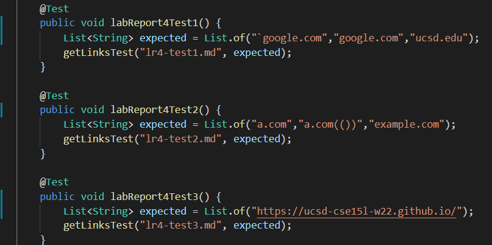
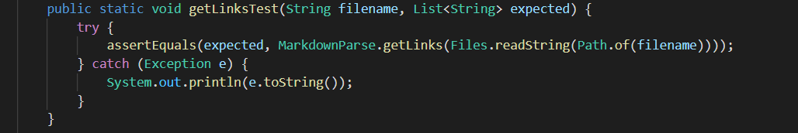
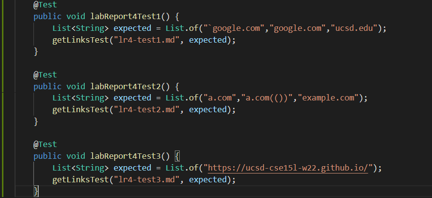
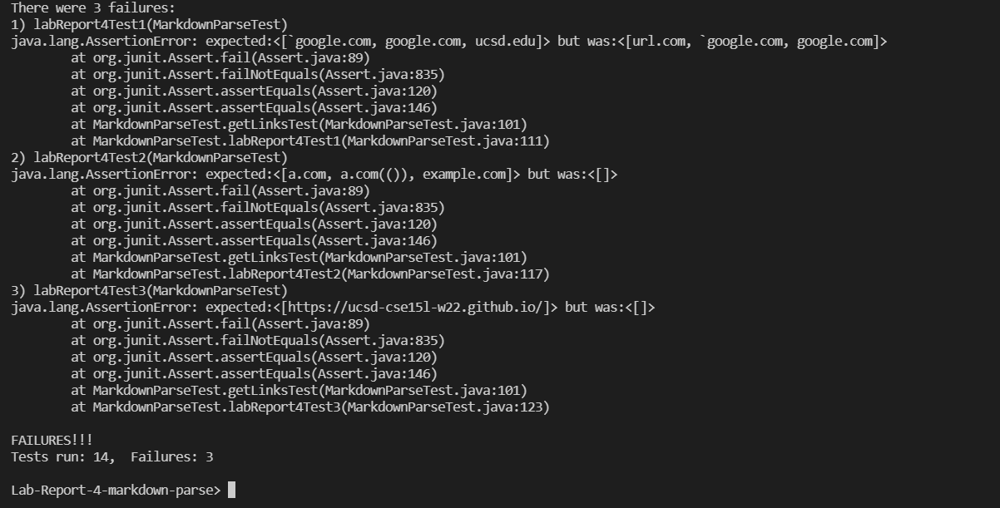
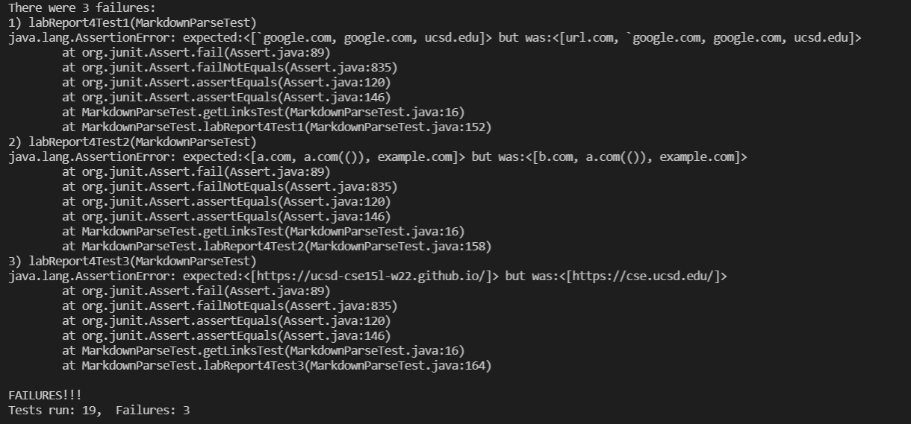

# CSE 15L: Lab Report 4, Week 8

Link to my markdown-parse repository: [atruong39/markdown-parse](https://github.com/atruong39/markdown-parse)

Link to repository that my group reviewed during Week 7 Lab by user jdweak: [jdweak/markdown-parse](https://github.com/jdweak/markdown-parse)

## Expected Results

For the first code snippet:

```
`[a link`](url.com)

[another link](`google.com)`

[`cod[e`](google.com)

[`code]`](ucsd.edu)
```

The expected result was:

```
[`google.com, google.com, ucsd.edu]
```

For the second code snippet:

```
[a [nested link](a.com)](b.com)

[a nested parenthesized url](a.com(()))

[some escaped \[ brackets \]](example.com)
```

The expected result was

```
[a.com, a.com(()), example.com]
```

For the third code snippet:

```
[this title text is really long and takes up more than 
one line

and has some line breaks](
    https://www.twitter.com
)

[this title text is really long and takes up more than 
one line](
    https://ucsd-cse15l-w22.github.io/
)


[this link doesn't have a closing parenthesis](github.com

And there's still some more text after that.

[this link doesn't have a closing parenthesis for a while](https://cse.ucsd.edu/


)

And then there's more text
```

The expected result as

```
[https://ucsd-cse15l-w22.github.io/]
```

## Implementation in `MarkdownParseTest.java`

Test implementation for my repo:



For reference, this is my `getLinksTest` method:



Test implementation for jdweak's repo (using my `getLinksTest` method):



## Test results for my repo

All 3 tests failed 



## Test results for jdweak's repo 

All 3 tests failed



## Questions

1. I think that a small changes could be made to enable my implementation of `MarkdownParse` to pass the first code snippet and similar related cases. My implementation uses a regular expression to find the determine which parts of the markdown file are links. 

    One approach would be to use one regular expression to check which parts of the markdown file are syntax for inline code and remove those parts from the file. Then use another to check the remainder for any syntax for links. 

    There would be some edge cases to consider however, such as how the following code would be valid syntax for a link

    ```
    [example](`example.com)`
    ```

    A overly simplistic regex looking for inline code syntax would change this line and make it no longer valid syntax for a link.

2. I think a small change would be possible to make my implementation work for the second code snippet, or similar cases. My regex already works with the escape brackets so all I would need to consider are the nested links. 

    My current regex is able to match the entire portion of the syntax, e.g.

    ```
    [example[example2](example2.com)](example.com)
    ```
    
    It will match the entire line, when only `[example2](example2.com)` is valid syntax for a link. 

    One idea would be to use my regex as usual, then use an additional regex on each check the text argument of each match for a nested link. 

3. I think a small change is possible to make my implementation work with the third code snippet, and all similar cases. Some changes need to be made to my regex in order to account for the number of vertical whitespace characters such as `\n`. 

    In anywhere except the URL argument of the link syntax, there can be at least one vertical whitespace character. However if there are two or more consecutively, then the syntax to become invalid. 

    A new regex I came up with is:

    ```
    (?<!!)\[\v{0,1}.+\v{0,1}.+\v{0,1}\]\(\v{0,1}\h*(\S+)\h*\v{0,1}\)
    ```

    For reference, the old one:

    ```
    (?<!!)\[.+\]\(\h*(\S+)\h*\)
    ```

    (Note: To use in Java, double backslashes are required)

    In the new regex, we have multiple assertions `\v{0,1}` which look for anywhere from 0 to 1 `\v` characters, vertical whitespace characters which include `\n`. This allows the regex to match the following string, which is valid link syntax

    ```
    [example
    example
    ](
    example.com
    )
    ```