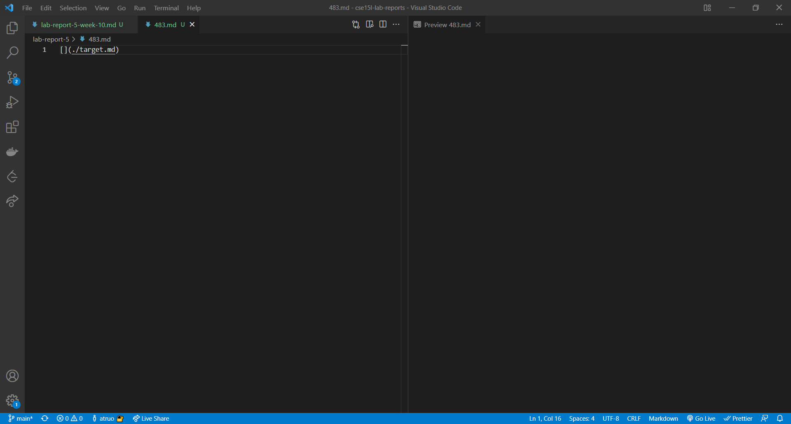
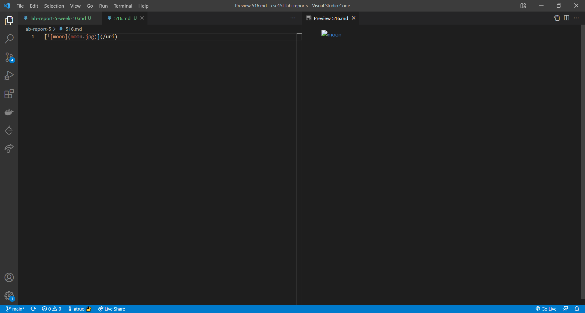

# CSE 15L: Lab Report 5, Week 10 

Two tests where Joe's and my implementation differed were `483.md`:

```
[](./target.md)
```

and `516.md`:

```
[](/uri)
```

These tests were found by using the `diff` command and comparing the `results.txt` file that were created during lab for each repo. 

By previewing the `md` files, we can see the expected results and compare with actual results for each implementation. 

## Results for `483.md`



The results for `483.md` should be: 

```
[]
```

My implementation:
```
[]
```

Joe's implementation: 
```
[./target.md]
```

Joe's implementation is incorrect as the text portion of the link syntax must have at least one non-whitespace character. It would require some additional code to check the text portion and see if it meets these conditions. 

## Results for `516.md`



The results for `516.md` should be: 

```
[/uri]
```

My implementation: 

```
[/uri]
```

Joe's implementation: 
```
[moon.jpg]
```

Joe's implementation is incorrect as while it correctly checks for nested links, it does not check if those nested links are images. If the text portion did not have the exclamation point, then Joe's implementation would be correct. It would require some additional code to ensure that if there is a nested link syntax, that it is not actually image syntax. 